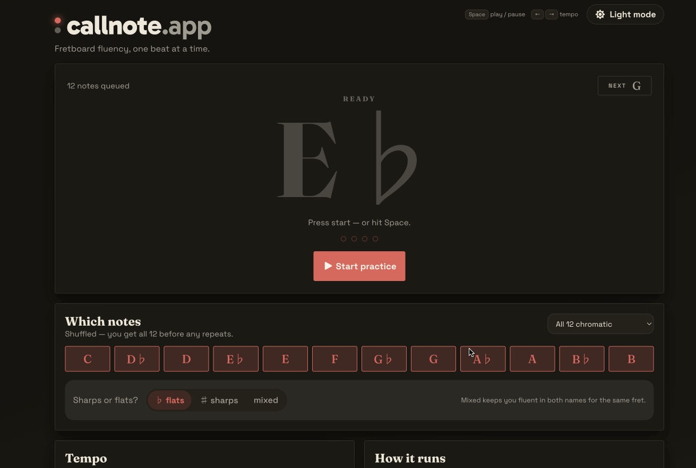

# callnote.app

**Fretboard fluency, one beat at a time.**

callnote.app is a small React and Vite practice app for guitar fretboard memorization. A metronome clicks, a note name is called on the beat, and you find it on the neck before the next one lands.



Pick your notes and a tempo, press start, and it calls a note on the metronome click.

## Features

- Shuffled-bag note calling: every note in the pool appears exactly once per cycle, no repeats —
  with a NEXT preview and a "note N of M" cycle position
- Note pool control: 12 tappable pitch-class chips plus presets (all 12, naturals, accidentals, the eight
  major keys — C, G, D, A, E, F, B♭ and E♭ — the A/E/D minor pentatonics and A minor blues) — plus Custom,
  which is what the selector reads back once the chips no longer match a preset. The selector groups
  presets by family — Chromatic & naturals, Major keys, Minor keys and Custom — and a custom selection
  can be saved under a name of your own, appearing in its own Saved group with a Delete option
- Enharmonic spelling as flats, sharps, or mixed — the spoken name always matches the displayed one
- Tempo (30–240 BPM, live-adjustable, tap tempo) split from the note-change rate
  (every 1/2/4/8/12 beats; the beat a new note lands on gets the accented click)
- Drift-free Web Audio scheduling: clicks and spoken samples are scheduled at explicit
  AudioContext times by a look-ahead scheduler
- "On the neck" fretboard map showing every position of the called note (frets 0–12, standard
  tuning), hideable from "How it runs"
- Speed ramp, in the Tempo card: the tempo climbs 2 BPM every completed round until it reaches a
  target you choose, then holds there — so a session ends on a tempo you reached, not the first one
  you missed. Routine blocks own their own ramp and ceiling
- Routines: an ordered list of blocks, where a block sets tempo, note pool, note-change rate and
  spelling for you. One untimed block is a saved setup that runs until you stop; add timed blocks
  and it becomes a workout that advances itself, with a proportional timeline and a Skip block
  button. A shelf of routines is seeded on first load, and touching a control mid-routine is
  reported as "adjusted, next block resets it" rather than silently overridden
- Practice log: 14 days of daily bars, current and best streak (a day counts at one minute of
  practice), and rolling 7-day minutes/notes totals. A History button on the card opens the whole log
  — a month-by-month heatmap with each day shaded by minutes and tappable to read its minutes and notes
  out under the calendar (today's until you pick one), totals across everything stored, and JSON backup
  export/import, where an import merges with what is already there (keeping the longer of any two days)
  rather than replacing it
- Listen for my playing (off by default): with the setting on, the app opens the microphone
  alongside playback and shows the note it hears under the called one, with a tick when it is the
  note asked for and a cross when it isn't. How in tune the string was is left to a tuner. A note
  that matches the call is named the way the call named it — E♭ stays E♭ rather than turning into
  D♯ — and the reading stays up until you play something else or the next note is called, rather
  than blinking out with the string. The count-in between rounds clears it: no note on screen, so
  nothing to be right or wrong about. The detector is a hand-rolled Web Audio autocorrelation, but it
  runs on a context of the capture's own rather than the one playback uses, opened while the mic
  session is live so it is born at the microphone's own sample rate — iOS moves the hardware rate
  when the mic opens, and analysing on the app's existing context would otherwise feed a rate
  mismatch into silence; it falls back to sharing the app's context only when a new one can't be
  built. Capture also asks for raw audio, with echo cancellation, noise suppression and automatic
  gain control all switched off, because every one of them is built for speech and would otherwise
  eat the sound of an instrument. What the app plays through the speakers is kept out of the reading
  by the cue intervals the engine records rather than by echo cancellation, so the readout reports
  you rather than itself. The mic is released the moment you pause, stop or leave, and a refusal or
  a browser without one says so and changes nothing else
- Mic diagnostics: appending `?micdebug` to the URL adds a plain-text overlay showing the mic status,
  the track settings the browser actually applied (whether the raw-capture request was honoured),
  both audio contexts' rates and states and which one is in use, and the live level, clarity and
  last detected pitch — meant for screenshotting when reporting a microphone bug
- Scoring, with the mic on: every note you actually play banks points, and four bonuses make them
  climb faster — a streak bonus from the third right note in a row up to a cap, a bonus for finding
  the called note in two octaves before the next one is called, a small one for striking the
  string in time with a click, and a flat 50/100/150 points for reaching 10, 20 and 30 minutes of
  session time. The practice milestones belong to no note, so unlike the other three they are never
  scaled by the difficulty multiplier below. Two octaves means two pitches and not two places on the neck: the mic
  hears pitch and nothing else, so finding the note twice in unison earns nothing. The in-time bonus
  is measured against the clicks that actually sounded, so the speed ramp cannot throw it off — and
  at one beat per note every beat starts a note, leaving no click under the note to play along with,
  so it is mostly there to be earned from two beats per note up. The mic is deaf while the click
  itself sounds, so a string struck on one is not heard until it stops ringing and lateness is
  allowed for that; above roughly 100 BPM the click covers too much of the beat to tell being in
  time from being late, and the bonus stops paying rather than paying everyone. Every note — and
  every bonus earned on it — is priced by the settings in force when it was *called*: mixed sharps
  and flats, the fretboard map put away, fewer beats per note and a faster tempo all pay more, while
  the two most generous note spans pay less than the flat rate. So does the note pool, which is the
  biggest factor of the lot: all twelve is what the app starts on and what the price is measured
  from, and every narrower pool is worth less — naturals only, accidentals only, or any handful of
  chips. Mixed spelling is tied to the same choice, since only the five accidentals have two names:
  ask for naturals only and mixed is a setting that changes nothing, so it pays nothing. All twelve
  with sharps and flats mixed is the top of both. The multiplier shows on the score
  line whenever it is anything other than ×1, so a discount is as plain as a premium and the line
  only stays quiet when a note is worth exactly what a note is worth. The price is frozen on the note as
  it is called, so nudging a setting mid-note moves the next one instead, and a bonus found late is
  paid at what its own note was worth. The tempo part is deliberately sublinear and capped: you
  already play more notes per minute at a faster tempo, so paying linearly on top of that would make
  speed worth roughly its square. Doubling the tempo is worth about 2.4× the points per minute
  rather than 4×, which is to say a couple of extra minutes of slow, accurate practice catches a
  faster player up. Points sit beside the running
  `hits/scored` accuracy rather than replacing it, they last as long as the session does, and
  nothing about them is stored or shared
- "How it runs": keep going (loop past the end of a cycle), a four-beat count-in, listening for
  your playing, and the fretboard map toggle. The spoken note name is always on
- Session card with practice goal (5/10/20 min), progress bar, and notes/cycles stats; tap the goal
  readout to flip it between counting up and counting down the remaining time
- Shared challenges: open the app at `/?challenge=<name>`, pick a nickname, and a top-ten
  scoreboard appears under the note. **The nickname is reserved for your browser** — claiming it
  hands back an ownership token, and nobody without that token can put a score under it, raise it
  or take it down. `Alice` and `alice` are the same name, and a name already taken is refused. Your
  play goes up whenever you pause or stop, as a stream of *events* rather than a total: the server
  does the arithmetic, keeps your best, and refreshes every 20 seconds while the page is on screen,
  so other people's rounds appear without a reload. It goes quiet while the tab is hidden. The
  microphone is asked for on arrival, since the points come from what it hears. Without
  `?challenge=` in the URL none of this exists: no board, no prompt, no request, and no microphone.
  The prompt can be dismissed, which leaves the board readable without putting you on it — and so
  does holding the link without a token, which is read-only access by design. Clearing this
  browser's storage loses the token, and with it that nickname: the server keeps only a digest, and
  anything that would hand you a new one would hand it to anybody
- Installable PWA: a service worker precaches the app shell and every note clip, so it launches
  and runs with no network. Chromium gets an Install button in the header, iOS a one-time
  Add-to-Home-Screen hint, and a cached new build offers a reload chip instead of reloading
  mid-session
- Stage layout: installed on a touch device, the app drops to the note, the beat dots and a
  transport, and moves the setup cards into a full-screen practice sheet — landscape puts the neck
  alongside the note
- The screen is kept awake while playing, and playback stops itself after a minute in the
  background rather than clicking on in a pocket
- Report a bug: a button in the footer opens a form that sends the report straight from the app —
  a description, an optional address to reply to, and a Cloudflare Turnstile check so the route
  isn't an open mail relay. Where the deployment has no keys for it (or the browser is offline) the
  modal says so plainly instead of offering a form it can't post. See
  [Reporting a bug](#reporting-a-bug)
- Light/dark theme, a Style picker in the footer with four skins (glass, instrument, editorial,
  warm), and every setting persisted to localStorage
- Keyboard shortcuts: Space play/pause, ←/→ (or ↑/↓) tempo, T tap tempo, R reset

## Run locally

```bash
npm install
npm run dev
```

Node 22 or newer. Audio playback begins only after a user interaction such as pressing the start
button.

## Build

```bash
npm run build
```

## Deploy

The repo ships a multi-stage `Dockerfile`: `node:24-alpine` builds the Vite app, and
`nginx:1.30-alpine` serves the static `dist/` output on port 80.

```bash
docker build -t callnote .
docker run --rm -p 8080:80 callnote                            # http://localhost:8080

docker run --rm -p 8080:80 wolasss/random-scale-trainer:latest # the published image

# ...and with the shared-challenge board kept across restarts
docker run --rm -p 8080:80 -v callnote-data:/var/lib/callnote callnote
```

### The scoreboard service

Shared challenges are the one thing here that is not a static file, so the image also carries a
small stdlib-only Node service (`src/server/`). nginx starts it from
`/docker-entrypoint.d/50-scoreboard.sh` and proxies `/api/` to it on loopback, so the run contract
is unchanged — still `docker run -p 8080:80`, still one container. In dev and `vite preview` the
same request handler is mounted as a Vite middleware instead (`vite.config.ts`), which is what
lets the e2e suite exercise a challenge without a second process.

Everything lives under `/api/scoreboard/<challenge>`. Reading is open to anybody holding the URL;
writing takes the ownership token issued when the nickname was claimed:

```bash
# Read the board. No credential, and no credential in the answer either.
curl localhost:8080/api/scoreboard/demo
# {"challenge":"demo","scores":[{"nickname":"ada","points":300}]}

# Reserve a nickname. Said once — the server keeps only its sha256.
curl -X POST -H 'Content-Type: application/json' \
     -d '{"nickname":"ada"}' localhost:8080/api/scoreboard/demo/nickname
# {"challenge":"demo","nickname":"ada","token":"…"}   (409 nickname_taken if it is spoken for)

# Open a scoring session, fixed at these settings from this moment.
curl -X POST -H 'Content-Type: application/json' -H "Authorization: Bearer $TOKEN" \
     -d '{"nickname":"ada","config":{"bpm":72,"beatsPerNote":4}}' \
     localhost:8080/api/scoreboard/demo/session
# {"challenge":"demo","sessionId":"…","config":{…},"expiresAt":…}

# Report what happened. The server adds it up; the answer is *its* total. A hit
# carries what its note was called under; one that carries none is priced flat.
curl -X POST -H 'Content-Type: application/json' -H "Authorization: Bearer $TOKEN" \
     -d '{"events":[
           {"seq":0,"kind":"hit","at":0,
            "difficulty":{"spelling":"mixed","showFretboard":false,"bpm":96,"beatsPerNote":4,
                          "pool":[0,1,2,3,4,5,6,7,8,9,10,11]}},
           {"seq":1,"kind":"hit","at":250}]}' \
     localhost:8080/api/scoreboard/demo/session/$SESSION/events
# {"challenge":"demo","points":25,"scores":[…]}       …then POST …/finish to close it.
```

The board keeps each nickname's **best**, so a session that ends lower changes nothing.
`SCOREBOARD_DATA` (default `/var/lib/callnote/scoreboard.json`) is where it is kept — mount it with
`-v` or a restart starts everyone from zero. Tokens survive that restart as digests; sessions do
not. The service listens on loopback port 8787, which is fixed rather than configurable: nginx
proxies to it by number, and only a matching pair works.

**Posting a total is gone**: `POST /api/scoreboard/<challenge>` with `{"nickname":…,"points":…}`
answers `410`. A score can only be reached through a session, and `session-scoring.js` bounds how
fast one can grow — an event may not claim a moment the server has not lived through, and two
judged notes may not be closer together than 250 ms, which is one beat per note at the app's top
tempo. The declared config is recorded and reported; it times nothing, so a routine that moves the
tempo mid-session is never read as cheating.

What a note is *worth* rides on the `hit` that reports it — `"difficulty":{"spelling":…,
"showFretboard":…,"bpm":…,"beatsPerNote":…,"pool":[…]}` — and the server prices it by the same
arithmetic `src/lib/scoring.ts` uses, so the board and the readout under the play button are one
number and not two. It is the note's own difficulty, frozen when the note was *called*, which is
why it cannot be a property of the session: a speed ramp reprices the next note and not the one
still sounding. The inputs are rejected rather than clamped if they are not settings the app
offers, which bounds one note at ×2.7048; nothing declared moves the wall clock or the spacing
floor, so a lie still has to be played out in real time.

Practice milestones come up the same wire as `{"kind":"milestone","milestone":"practice10"}` and
are paid flat — no note's price applies to a bonus no note earned — once each, and only when the
server's own clock agrees the session has run that long. The two clocks cannot be the same one
(the app's is practice time; the session's starts at the first note called), so the check carries
`MILESTONE_LEAD_MS` of slack: it is there to refuse a thirty-minute bonus from a session a minute
old, not to arbitrate the last few seconds of an honest one. A claim that is too early answers
`too_soon`.

`session-scoring.test.ts` runs both pricing functions over every setup the app can produce and
asserts they agree, and `src/App.parity.test.tsx` plays a session through the real app against the
real service — including one that sits past ten minutes — and asserts the two totals match.

Around that sit the limits in `src/server/scoreboard.js` — 1,000,000 points, 500 nicknames per
challenge, 200 challenges, 30 new challenges an hour overall, 2,000 live sessions, and a sweep for
abandoned sessions and for claims nobody ever scored under (capped at 400 unscored owners per
challenge, swept after 24 hours unused). Per-client rate limits cover claims (10 a minute, and 400
an hour per challenge), session starts (10 a minute) and event posts (120 a minute).
`src/server/session-scoring.js` adds its own ceilings on a session once it exists: 20 events per
batch, 5,000 events over its lifetime, and a 2-hour cap on how long it can run. Request bodies are
capped in `src/server/http.js` — 4 KB (`MAX_BODY_BYTES`) for most routes, 8 KB for the bug-report
route alone. None of this proves somebody physically played a guitar; what it does is stop a
scripted client putting an arbitrary number on a board, and stop a stranger touching a row that is
not theirs. Don't put anything you care about on a public board.

### Reporting a bug

The footer's bug button opens a form that posts to `/api/bug-report`, served by the same Node
process. It needs a captcha to check and somewhere to send the report, and both are environment —
**with any of them unset the route answers `not_configured` and the modal says reporting is not
switched on for this build.** Everything else keeps working; nothing about the app depends on it.

| Variable | What it is |
| --- | --- |
| `TURNSTILE_SITE_KEY` | The public half of a [Cloudflare Turnstile](https://developers.cloudflare.com/turnstile/) pair. Served to the page at run time by `/api/bug-report/config`, never baked into the bundle. |
| `TURNSTILE_SECRET_KEY` | The other half. Read once, in this process, and used only to verify a token server-side. |
| `MAILGUN_API_KEY` | Mailgun's HTTP API key. Never logged, never echoed, never sent anywhere but the `Authorization` header. |
| `MAILGUN_DOMAIN` | The Mailgun sending domain. |
| `MAILGUN_API_BASE` | Optional; defaults to `https://api.mailgun.net/v3`. An EU-region account needs `https://api.eu.mailgun.net/v3` — the US host cannot see an EU domain. |
| `BUG_REPORT_TO` | Optional; defaults to `bugs@$MAILGUN_DOMAIN`. |
| `BUG_REPORT_FROM` | Optional; defaults to `callnote bug reports <bugs@$MAILGUN_DOMAIN>`. |

```bash
docker run --rm -p 8080:80 \
  -e TURNSTILE_SITE_KEY=0x… -e TURNSTILE_SECRET_KEY=0x… \
  -e MAILGUN_API_KEY=key-… -e MAILGUN_DOMAIN=mg.example.com \
  -e BUG_REPORT_TO=you@example.com \
  callnote
```

The captcha is there because the alternative is an open mail relay with a Send button on it. The
token the widget produces is checked against the secret key by the server — a form posted by
anything that isn't a browser with a person behind it gets a `403` and no mail. Rate limits sit
*before* that check (5 reports per client per 10 minutes, 60 an hour overall), so hammering wrong
tokens costs the sender their allowance rather than costing the service a round trip each.

`vite dev` and `vite preview` use Cloudflare's always-passes **test** keys and a sender that only
logs, so the whole round trip is exercisable — and exercised, by `e2e/specs/14-bug-report.test.ts` —
without a real key anywhere. Setting the real environment makes them step aside.

This is the only third-party origin the page loads anything from, and it costs the CSP exactly two
directives: `https://challenges.cloudflare.com` in `script-src` and in `frame-src`. `connect-src`
stays `'self'` — the token check is made by the service, which no CSP governs.

Serving the microphone at all needs `Permissions-Policy: microphone=(self)`, which `nginx.conf`
now sends on every response (it was `microphone=()`, which forbade `getUserMedia` outright). It is
`(self)` and never `*` — this origin only, nothing it embeds.

Every release pushes `wolasss/random-scale-trainer` to Docker Hub for linux/amd64 and
linux/arm64, tagged with the semantic-release version and `latest`
(`.github/workflows/release.yml`).

`nginx.conf` sets the caching deliberately. Unknown paths fall back to `index.html`, so client-side
routes resolve. `/sw.js` is sent `no-cache, no-store, must-revalidate`, and `index.html` and
`manifest.webmanifest` are sent `no-cache`: a cached service worker is a build the browser can
never move off, and index.html is what names the hashed bundles, so a stale shell pins everyone to
the old ones. Everything else matching the static-file extension list (js, css, images, fonts,
mp3) gets `expires 7d` and `Cache-Control: public` — that rule is matched on extension, not on the
presence of a content hash, so only the three exact-match locations above it escape it.

## Tests

```bash
npm test             # Vitest unit + integration suite
npm run test:e2e:ci  # Selenium e2e against a production preview (see e2e/README.md)
npm run check        # lint + e2e typecheck + Vitest + build — what CI runs
```

## Notes

- Spoken note names are pre-rendered MP3s (`public/audio/notes/`, generated by
  `scripts/generate-note-audio.sh`) covering both flat and sharp spellings. A clip that fails to
  download falls back to SpeechSynthesis for that note.
- The click is the authoritative beat: everything is scheduled ~250ms ahead at exact
  AudioContext times, and visuals sync to the audio clock via a rAF queue.
- The service worker is built from `src/sw/service-worker.js` by a Vite plugin
  (`vite.config.ts`), which fills in the content-hashed precache list and a cache version derived
  from it, and is registered in production builds only.

## Brand

`brand/callnote-brand-guide.md` is the source of truth for the mark. In the app the lockup is live
text (`src/components/BrandLockup.tsx` + the BRAND block in `src/index.css`) whose `--brand-*`
tokens alias the active skin's own palette — so the call dot is always the same colour as the
Resume button, in every skin, without a per-skin logo.

The exported SVGs in `brand/` and the PWA's PNG icons are generated, not drawn:

```bash
python3 scripts/generate-brand-assets.py   # brand/*.svg + public/favicon.svg
node scripts/rasterize-icons.mjs           # public/icon-*.png (needs playwright)
```

Adding a skin means adding a row to `THEMES` in the first script; there is no second drawing to
keep in sync.

## License

MIT — see [LICENSE](LICENSE). Free for anyone to use, modify and redistribute, personally or
commercially, as long as the copyright and permission notice travel with the code.

MIT ships the app as-is: no warranty and no support obligation. It is a copyright licence only —
the `callnote.app` name and the marks in `brand/` stay trademarks of the copyright holder, so a
fork can copy and change those files but shouldn't pass itself off as Callnote. If your team needs
more than that — a support
commitment, a warranty, indemnity, or different terms — open an issue at
<https://github.com/wolasss/random-scale-trainer/issues> and we can talk about a commercial
agreement.
